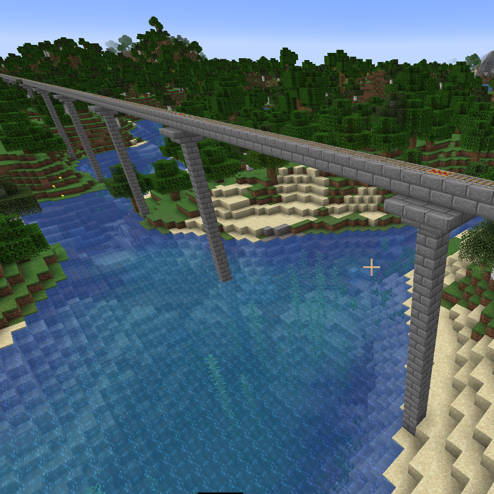
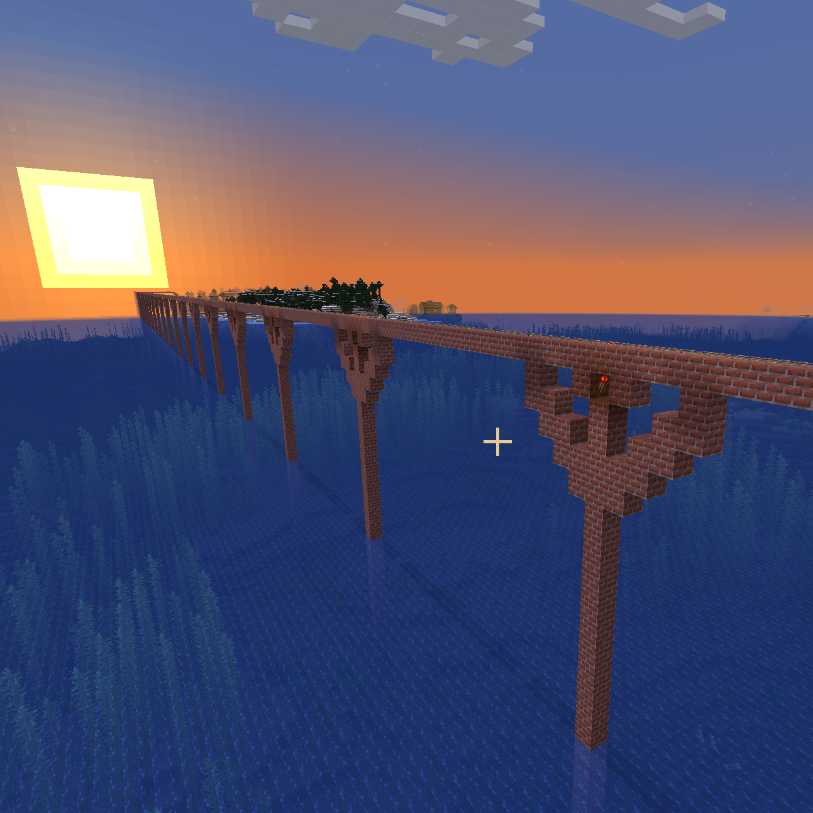

## Railroads ##
### Example 1 ###

```
relativePosA = Relative(Vec3(275,8,-1260), -91.02582)
relativePosB = Relative(Vec3(1180,8,-1260), 89.27374)

a = relativePosA.bottom(1)
b = relativePosB
used = Used(a.get_current(), a.get_current(), mc.getBlocks(a.get_current(), a.get_current()))
style = Style()
style.bottom = block.STONE_BRICK.id
style.pillar = block.STONE_BRICK.id
style.cornice = block.STAIRS_STONE_BRICK

rr = Railroad(mc, used, style)
rr.draw(
    a,
    b,
    CorniceSupport(mc, (Pillar(mc, PutBlockAndRail(mc, used, style)))),
    ChickenStop(mc, used, style)
)
```
### Example 2 ###

```
style = Style()
style.bottom = block.BRICK_BLOCK.id
style.pillar = block.BRICK_BLOCK.id
style.cornice = block.STAIRS_BRICK.id

rr = Railroad(mc, used, style)
rr.draw(
    a,
    b,
    FlatSupport(mc, (Pillar(mc, PutBlockAndRail(mc, used, style)))),
    ChickenStop(mc, used, style)
)
```