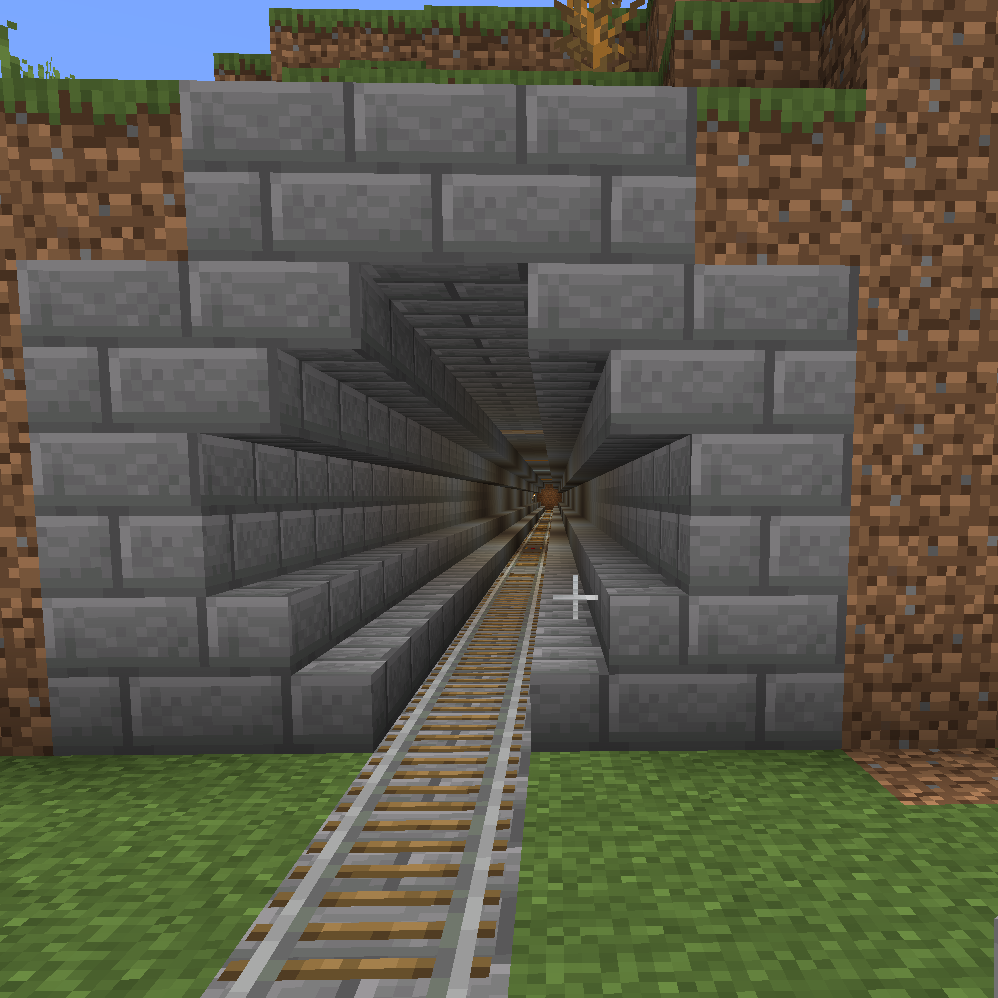

## Railroads ##
### Example 1 ###

```
relativePosA = Relative(Vec3(275,8,-1260), -91.02582)
relativePosB = Relative(Vec3(1180,8,-1260), 89.27374)

a = relativePosA.bottom(1)
b = relativePosB
used = Used(a.get_current(), a.get_current(), mc.getBlocks(a.get_current(), a.get_current()))
style = Style()
style.bottom = block.STONE_BRICK.id
style.pillar = block.STONE_BRICK.id
style.cornice = block.STAIRS_STONE_BRICK

rr = Railroad(mc, used, style)
rr.draw(
    a,
    b,
    CorniceSupport(mc, (Pillar(mc, PutBlockAndRail(mc, used, style)))),
    ChickenStop(mc, used, style)
)
```
### Example 2 ###

```
style = Style()
style.bottom = block.BRICK_BLOCK.id
style.pillar = block.BRICK_BLOCK.id
style.cornice = block.STAIRS_BRICK.id

rr = Railroad(mc, used, style)
rr.draw(
    a,
    b,
    FlatSupport(mc, (Pillar(mc, PutBlockAndRail(mc, used, style)))),
    ChickenStop(mc, used, style)
)
```
### Example3 ###

```
style = Style(bottom=block.STONE_BRICK.id, pillar=block.STONE_BRICK.id, cornice=block.STAIRS_STONE_BRICK)
tunnel_style = Style(top=block.STONE_BRICK.id, wall=block.STONE_BRICK.id, corner=block.STAIRS_STONE_BRICK.id, rounding=block.STAIRS_STONE_BRICK)
light_blocks = [
    block.Block(169),  # SeaLantern
    block.GLOWSTONE_BLOCK,
    block.LIT_PUMPKIN,
    block.GLOWSTONE_BLOCK,
    block.TORCH
]
strategy = Tunnel9(self.mc, tunnel_style, flume)
strategy_decorated = TunnelLight(self.mc, TunnelRound(self.mc, strategy), light_blocks=light_blocks, frequency_min=5, frequency_max=20)
rr.set_strategy_for_tunnel(strategy_decorated)
```

### Example4 ###

```
strategy = Tunnel9(self.mc, tunnel_style, flume)
strategy_decorated = TunnelLight(self.mc, strategy, [block.TORCH], frequency_min=5, frequency_max=20)
rr.set_strategy_for_tunnel(strategy_decorated)
```

### Example5 ###


```
light_blocks = [
    block.GLOWSTONE_BLOCK,
    block.TORCH
]
strategy = Tunnel6(self.mc, tunnel_style, flume)
strategy_decorated = TunnelLight(self.mc, strategy, light_blocks=light_blocks, frequency_min=5, frequency_max=20)
rr.set_strategy_for_tunnel(strategy_decorated)
```

### Example6 ###


```
./build funnel
```


### Example7 ###


```
pip3 install qrcode
./build verticalQr 'any text here'
```